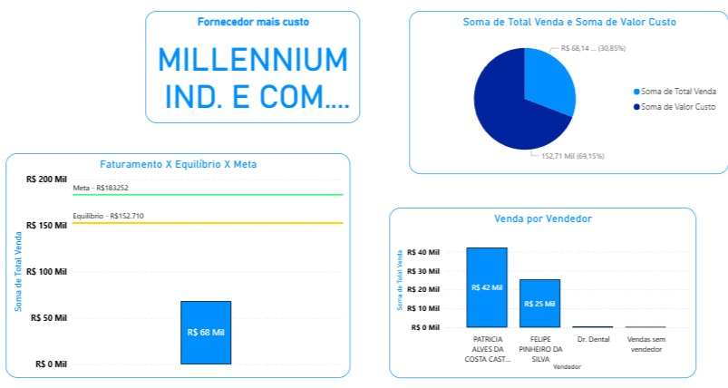
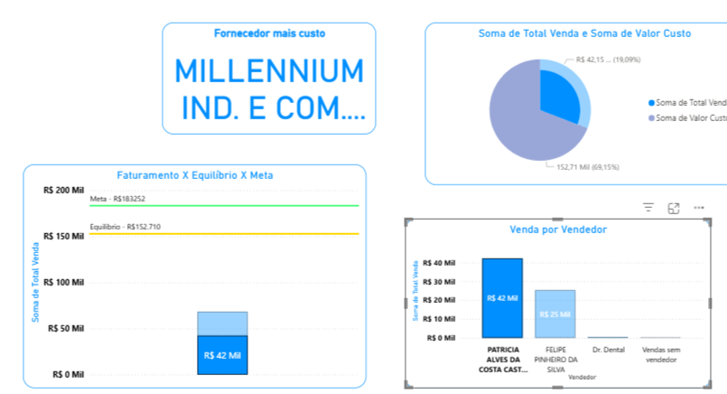

# 📊 Relatório Comparativo Dental

Este repositório contém um projeto desenvolvido em **Power BI Desktop**, com foco em análise de dados da área odontológica.  
O relatório foi construído a partir de dados extraídos do **ERP da empresa**, passando por tratamento e modelagem antes da visualização final.  

---

## 📷 Visualizações

### Visão Geral

### Exemplo com Filtros

---

## 🛠️ Ferramentas Utilizadas
- **Excel** para tratamento inicial de dados  
- **Power Query** para transformação e consolidação  
- **Power BI Desktop** para modelagem, criação de medidas e visualização a  

---

## 🚀 Objetivo
Apresentar uma visão consolidada e interativa, possibilitando:  
- Comparação de métricas relevantes entre períodos  
- Análise de custos e resultados  
- Identificação de pontos de melhoria  

---

## 💡 Experiência Aplicada
Na construção deste relatório, foram aplicados conhecimentos de:  
- **Tratamento e limpeza de dados** (Excel e Power Query)  
- **Modelagem de dados** no Power BI  
- **Criação de medidas em DAX** para cálculos personalizados  
- **Design de dashboards** com foco em clareza e usabilidade  
- **Análise de indicadores de desempenho** para apoio à gestão  
